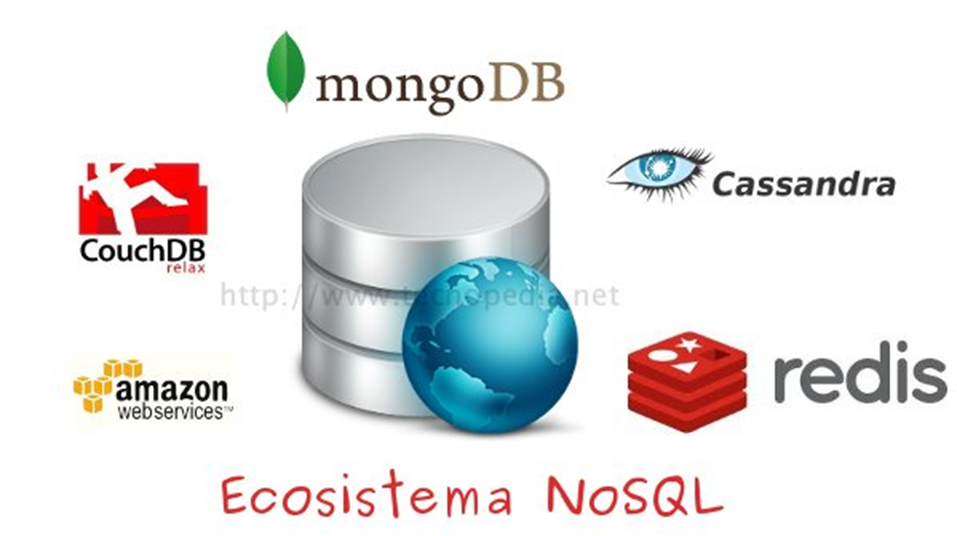
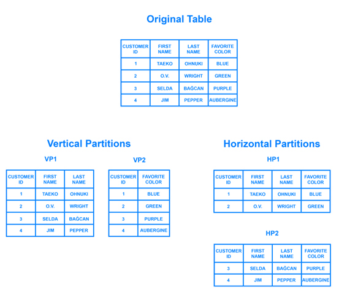
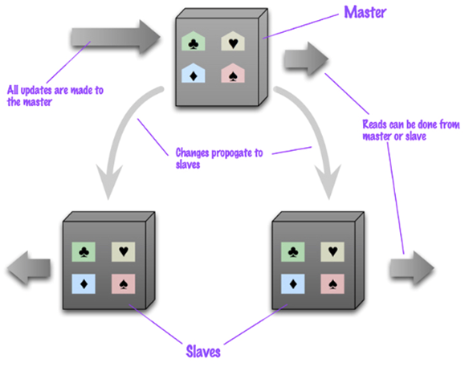
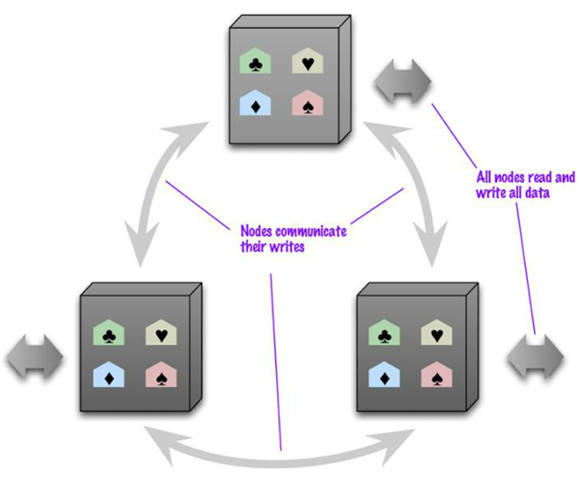
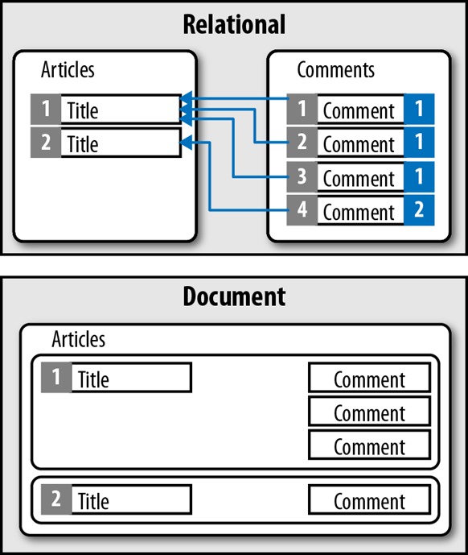
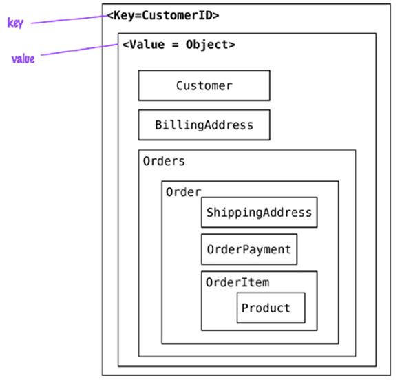
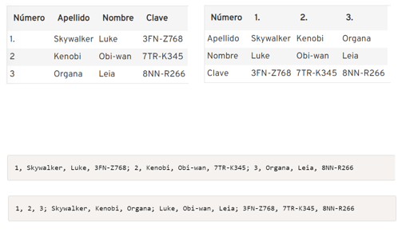
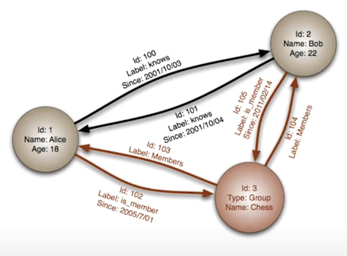
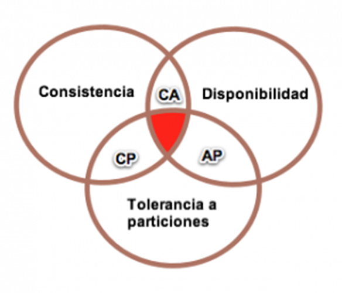
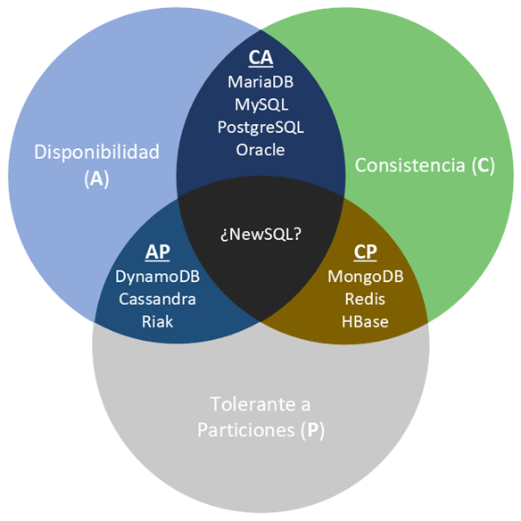

# Unidade 2 – Bases de Datos NoSQL


# 1. Introdución ás BBDD NoSQL

Estamos na terceira plataforma de almacenamento de datos:

## 1.1 Evolución das plataformas
1. **1ª plataforma:** ordenadores → modelo relacional  
2. **2ª xeración:** internet → modelo cliente-servidor  
3. **3ª xeración:** cloud, RRSS, dispositivos móbiles → NoSQL e Big Data  

**NoSQL (Not Only SQL)** complementa ás BBDD relacionais para resolver:

- Grandes volumes de datos
- Alta velocidade de acceso
- Datos semi/non estruturados
- Necesidade de escalabilidade horizontal
- Flexibilidade do esquema

---

## 1.2 Propiedades ACID vs necesidade de flexibilidade
**ACID**:

- **Atomicidade:** ou todo ou nada  
- **Consistencia:** estados válidos  
- **Illamento:** transaccións independentes  
- **Durabilidade:** os datos non se perden  

Nos escenarios modernos, este modelo é demasiado restritivo.

---

## 1.3 Tipos de BBDD NoSQL

- **Clave-valor:** Redis, Riak, DynamoDB, *Elasticsearch (internamente)*  
- **Documentais:** MongoDB, CouchDB, Elasticsearch  
- **Columnar / Wide-Column:** Cassandra, HBase, BigTable  
- **Grafos:** Neo4j, ArangoDB, Neptune  

---

# 2. Características comúns das BBDD NoSQL

- Admite datos estruturados, semi-estruturados e non estruturados  
- Esquemas dinámicos  
- Escalabilidade horizontal nativa  
- Alta dispoñibilidade  
- Replicación e particionado nativos  

---

# 3. Esquemas dinámicos
As BBDDR requiren esquema fixo.

Esto choca cos enfoques de desenvolvemento áxil, xa que ao engadir novas funcionalidades o esquema pode cambiar -> Se se engade un campo a unha táboa hai que migrar a BD a un novo esquema.

As BBDD NoSQL permiten inserir documentos con diferentes campos, evitando migracións custosas.

---

# 4. Particionado (Sharding)

## 4.1 Por que particionar?

- Escalar horizontalmente  
- Mellorar rendemento  
- Evitar límites de tamaño  



## 4.2 Tipos

- **Horizontal:** filas/documentos distribuídos  
- **Vertical:** columnas distribuídas  

## 4.3 Estratexias

### 4.3.1 Por rangos (Range-based Sharding)

Estrategia de escalado horizontal donde los datos se asignan según intervalos de valores de una clave.  
Ejemplo por Id:

> Shard 1 → IDs 1 – 10000  
Shard 2 → IDs 10001 – 20000  
Shard 3 → IDs 20001 – 30000

Ejemplo por fecha:
> Shard 1 → 2025  
Shard 2 → 2026  
Shard 3 → 2027  

#### Ventajas

- Eficiente para consultas por rangos específicos.
  - Por fechas
  - Precios
  - Ids consecutivos
- Implementación lógica fácil de entender y depurar.

#### Desventajas

- Riesgos de hotspost. El shard *actual* recibe todas las escrituras mientras los demás se encuentran infrautilizados.
- Distribución desigual. Dependiendo de los datos podemos tener shards mucho más densos que otros. Ejemplo: ventas de juguetes por mes.
- Necesidad de tablas de búsqueda, *un smart client* o proxys intermedios.

#### Casos de uso ideales

- **Series temporales**: Fragmentar por marcas de tiempo para acceder rápidamente a periodos específicos.
- **Sistemas financieros**: Agrupar transacciones por rangos de ID de cuenta o fechas.
- **Geolocalización**: Dividir datos por regiones o códigos postales (a menudo llamado geo-sharding).

### 4.3.2 Por listas *(List-based Sharding)* 

Estrategia de escalado horizontal donde los datos se asignan a fragmentos específicos (shards) basándose en una lista de valores discretos predefinida. A diferencia del caso anterior, esta técnica agrupa registros que comparten atributos específicos.  
Ejemplos por localización:
> Shard 1 → España, Portugal  
Shard 2 → Francia, Italia  
Shard 3 → Alemania, Austria  

Por tipo de usuario:
> Shard 1 → usuarios premium  
Shard 2 → usuarios free

#### Ventajas

- **Control total** sobre donde va cada dato. Ideal para cumplir normativas legales (como GDPR) al mantener datos de regiones específicas en servidores locales.
- **Optimización de recursos** al permitir asignar los servidores más potentes a los valores con más carga.
- Es un sistema **flexible** que nos permite añadir nuevos valores o a la lista o reubicar valores existentes sin necesidad de reestructurar todo el sistema.

#### Desventajas

- Necesidad de tablas de búsqueda, *un smart client* o proxys intermedios.
- Existe riesgo de Hotspots si un valor de la lista crece mucho más que otros.
- La tabla de mapeo debe estar siempre actualizada. Cualquier error en la misma hará que la aplicación no encuentre los datos.
- Las consultas que no incluyan la clave de la lista deben enviarse a todos los nodos *(fan-out)*.

#### Casos de uso

- Segmentaciones muy claras (países, tipo de cliente, tipo de usuario)
- Multitenancy *arquitectura en la que una única aplicación y/o base de datos da servicio a varios clientes independientes, llamados tenants*.

### 4.3.3 Por hash *(Hash-based Sharding)*

Estrategia de escalado horizontal que utiliza una función matemática para distribuir los datos de forma automática y uniforme entre varios servidores o nodos. A diferencia de los métodos anteriores, la decisión de dónde va cada dato recae en un algoritmo y no en el desarrollador.  

Funcionamiento:

1. Elección de la Shard Key: Se selecciona una columna con alta cardinalidad (muchos valores únicos), como `user_id` u `order_id`.
2. Aplicación de función de dispersión hash.
3. Operación módulo sobre el resultado. El resultado se somete a una operación de módulo (%) basada en el número total de fragmentos. Por ejemplo para un sistema con 3 shards el cálculo sería: `$hash % 3`

#### Ventajas

- Distribución equilibrada. Evita hotsports.
- Alta escalabilidad.
- No necesita tablas de búsqueda.


### Exemplos

- **Elasticsearch:** shards primarios e réplicas  
- **MongoDB:** particionado por clave shard key  
- **Cassandra:** [hashing consistente](<anexo 2. Hashing consistente.md>)  

Ahora vamos a revisar los [diferentes sistema de búsqueda](<anexo 1. sistemas busqueda sharding.md>) cuando utilizamos sharding.

---

# 5. Replicación

## 5.1 Tipos

### Maestro-esclavo / Primario-secundario

- Un nodo escribe  
- Secundarios replican  
- Control central, consistencia fuerte 


### Peer-to-peer

- Todos os nodos escriben  
- Pode haber conflitos  
- Máxima disponibilidad


### Modelo Elasticsearch

- Cada shard primario ten réplicas  
- Lecturas moi rápidas e tolerancia a fallos  
- Optimizado para búsquedas

# Diagrama Elasticsearch

```
                    CLIENTE
                       │
                       ▼
                ┌──────────────┐
                │  COORDINADOR │
                └──────┬───────┘
                       │
        ┌──────────────┼──────────────┐
        ▼              ▼              ▼
   ┌────────┐    ┌────────┐    ┌────────┐
   │ Nodo A │    │ Nodo B │    │ Nodo C │
   └──┬─────┘    └──┬─────┘    └──┬─────┘
      │              │              │
      ▼              ▼              ▼

  [Shard 1P]    [Shard 2P]    [Shard 3P]
  [Shard 2R]    [Shard 3R]    [Shard 1R]
```

## Funcionamiento

### Escritura
- Cliente -> Nodo coordinador
- Se calcula el shard (hash del _id)
- Se escribe en el **Primary shard**
- Se replica en los **Replica shards**

### Lectura
- Cliente -> Nodo coordinador
- Se envía la consulta a todos los shards relevantes
- Cada shard responde en paralelo
- El coordinador combina resultados

---
En definitiva, un contorno seguro é aquel no que os datos están **particionados** e **replicados**.


# 6. Implantación de NoSQL
Factores a ter en conta:
- Escalabilidade e rendemento
- Identificar alternativas viables respecto a software propietario
- Incrementar velocidade do proceso de desenvolvemento.

## 6.1 Dimensións clave

- Modelo de datos  
- Modelo de consultas  
- Modelo de consistencia  
- APIs e soporte  
- Comunidade  

## 6.2 Casos de uso xerais

- Datos personalizables → documental  
- Caché → clave-valor  
- Volumes masivos pouco consistentes → columnar  
- Relacións complexas → grafos  

---

# 7. Modelos NoSQL detallados

---

# 7.1 Modelo Documental

Frente as BBDDR, que almacenan datos en filas e columnas, as BBDD Documentais emplean Documentos (estructura JSON), que permiten modelar datos de maneira similar á OO.
Os documentos agrúpanse en coleccións ou BBDD.
Os datos van xuntos e almacénanse xuntos.



## Características

- Documentos JSON/BSON  
- Esquema flexible  
- Consultas complexas  
- Relacións embebidas ou referenciadas  
- Escalabilidade horizontal  

## Exemplos

- [MongoDB](https://www.mongodb.com)
- [CouchDB](https://couchdb.apache.org)
- [Elasticsearch](https://www.elastic.co/elasticsearch)


## Casos de uso

Recomendado:
- CMS  
- eCommerce  
- APIs  
- Logs indexados (Elasticsearch)  

Non recomendado:
- Transaccións complexas  
- Relacións moi profundas  

---

# 7.2 Modelo Clave-Valor

- Táboa hash onde todos los accesos se realizan a través da clave primaria.
- Son o modelo NoSQL más básico.
- O seu funcionamiento é similar a una táboa relacional con dúas columnas.
  - Id: Identificador.
  - Valor: pode ser un dato simple ou un objecto.


## Características

- Acceso por clave  
- Rendemento extremo  
- Valores opacos  

## Exemplos

- [Redis](https://redis.io)
- [Riak](https://riak.com)
- [Amazon DynamoDB](https://aws.amazon.com/dynamodb/)
- [Voldemort (implementación open-source de DynamoDB)](http://Project-Voldemort.com/voldemort)


## Casos de uso

Recomendado:
- Caché  
- Sesións  
- Contadores  
- Rate-limiting  

Non recomendado:
- Consultas complexas  
- Relacións  

---

# 7.3 Modelo Columnar

- Nas BBDDR por cada entrada créase unha fila.
- No modelo columnar, polo contrario, créase unha columna.
- En ambos casos, en disco, os datos escríbense de forma secuencial.
- Os SGBBDD que siguen este modelo están baseados na tecnoloxía BigTable de Google



## Características

- Datos organizados en Column Families  
- Lecturas por columnas moi eficientes  
- Altísima escalabilidade  

## Exemplos

- [Cassandra](https://cassandra.apache.org)
- [HBase](https://hbase.apache.org)
- [Bigtable](https://cloud.google.com/bigtable)
- [Amazon Redshift](https://aws.amazon.com/redshift/)


## Casos de uso

Recomendado:
- Analítica  
- Data Lakehouse  
- Time-series  

Non recomendado:
- OLTP tradicional  

---

## 7.4 Modelo de Grafos

Almacenan entidades e as relacións entre estas:

- **Nodos** (entidades): Identificador e propiedades
- **Vértices** (relacións): Identificador, propiedades e dirección
Os datos almacénanse unha vez e interprétanse de diferentes maneiras dependendo das relacións.


## Características
- Nodos + vértices  
- Traversals eficientes  

## Exemplos

- [Neo4j](https://neo4j.com/) — O grafo máis popular e maduro, ideal para recomendacións e RRSS.
- [ArangoDB](https://www.arangodb.com/) — Motor multimodelo (documental + grafo + clave-valor).
- [Amazon Neptune](https://aws.amazon.com/neptune/) — Grafo xestionado na nube, optimizado para RDF e Property Graph.
- [JanusGraph](https://janusgraph.org/) — Grafo distribuído open-source, compatible con Cassandra, HBase e Bigtable.
- [OrientDB](https://orientdb.org/) — Outro sistema multimodelo con capacidades de grafo e documental.


## Casos de uso
Recomendado:

- RRSS  
- Recomendacións  
- Mapas  

Non recomendado:
- Grandes cambios estruturais constantes  

---

# 8. Consistencia (CAP e BASE)

---------------------------------------------------------------------

# 8.1 Consistencia forte vs eventual

- **Forte:** todas as réplicas sincronizadas  
- **Eventual:** pode haber atraso  

---

# 8.2 Teorema CAP explicado

Nun sistema distribuído só podes ter 2 de:

- **C → Consistencia**: As escritursa son atómicas e todas as peticións posteriores obteñen el nuevo valor.  
- **A → Dispoñibilidade** :  BD devolve sempre un valor (non hai *downtime*).
- **P → Particións toleradas**: O sistema funcionará incluso se a conexión co servidor se interrompe.



Como P sempre debe existir en sistemas distribuídos reais, elixes entre **C ou A cando hai fallos**.


---

## Exemplos reais

### **1. Banco / Caixeiro → CP**

- Prefírese non operar se hai dúbidas  
- Priorízase consistencia  

BD asociada: **HBase**

---

### **2. Twitter / Instagram → AP**

- Sempre responde  
- Podes non ver o último cambio inmediatamente  

BD asociada: **Cassandra**, **Elasticsearch**

---

### **3. Sistema local monolítico → CA (teórico)**

---

# 8.3 Modelo BASE explicado

- **Basically Available:** sempre responde  
- **Soft State:** pode haber estados intermedios  
- **Eventual Consistency:** sincronización final garantida  

---

# 8.4 Resumo práctico

| Sistema | Modelo CAP | Consistencia |
|---------|-------------|--------------|
| Cassandra | AP | eventual |
| Elasticsearch | AP | eventual |
| MongoDB | configurable | forte/eventual |
| HBase | CP | forte |

---

# 9. Comparativa xeral dos modelos NoSQL

| Modelo | Estrutura | Vantaxes | Limitacións | Exemplos |
|--------|-----------|----------|-------------|-----------|
| Documental | JSON | Flexibilidade, consultas, API-friendly | Transaccións limitadas | MongoDB, CouchDB, Elasticsearch |
| Clave-Valor | Key → Value | Máxima velocidade | Non consulta por valor | Redis, Riak, DynamoDB |
| Columnar | Column Families | Analítica, big data | Non apto para OLTP | Cassandra, HBase |
| Grafos | Nodos + relacións | Relacións complexas | Peor en datos masivos | Neo4j, ArangoDB |

---

# 10. Casos de uso modernos e realistas

## 10.1 Observabilidade e logs → Elasticsearch

- Logs  
- Monitorización  
- Dashboards (Kibana)  

## 10.2 Microservizos → MongoDB / DynamoDB  

- APIs  
- Perfiles  
- Inventario  

## 10.3 Analítica masiva → Cassandra  

- Time-series  
- Telemetría  
- Uso global  

## 10.4 Recomendacións → Grafos  

- RRSS  
- Produtos relacionados  

## 10.5 IoT e sensores → Cassandra / Elasticsearch  

- Envío masivo de datos  
- Consultas por tempo  

---

# 11. Referencias
- [Apuntamentos de Aitor Medrano](https://aitor-medrano.github.io/)
- [Next Generation Databases](https://link.springer.com/book/10.1007/978-1-4842-1329-2)
- [Understanding Database Sharding](https://www.digitalocean.com/community/tutorials/understanding-database-sharding)
- [The Design and Implementation of Modern Column-Oriented Database Systems (Foundations and Trends in Databases)](https://www.amazon.com/Implementation-Column-Oriented-Database-Foundations-Databases/dp/1601987544)
 ## Documentación oficial

- **MongoDB** → https://www.mongodb.com/docs/
- **Elasticsearch** → https://www.elastic.co/guide/en/elasticsearch/reference/current/index.html
- **OpenSearch** → https://opensearch.org/docs/latest/
- **Apache Cassandra** → https://cassandra.apache.org/doc/latest/
- **Apache HBase** → https://hbase.apache.org/book.html
- **Neo4j** → https://neo4j.com/docs/
