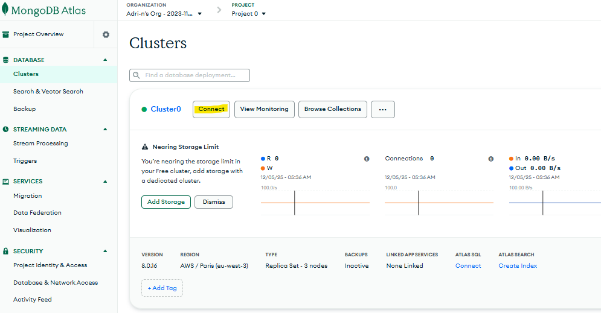
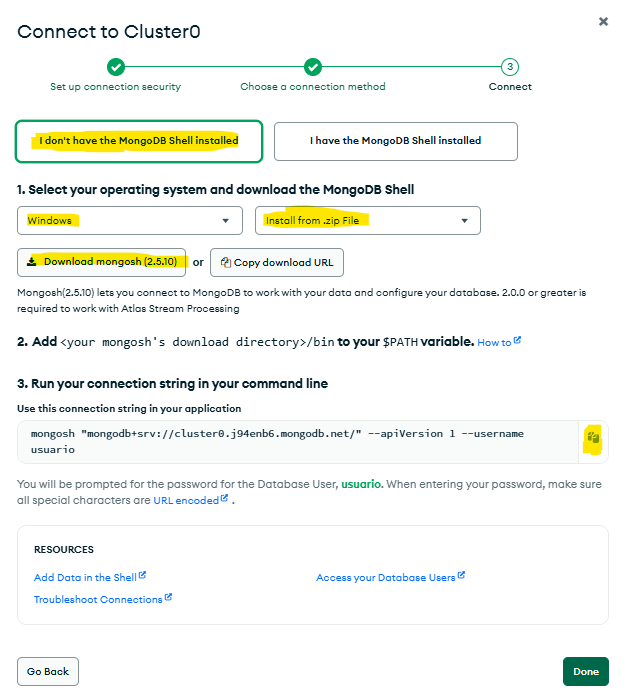
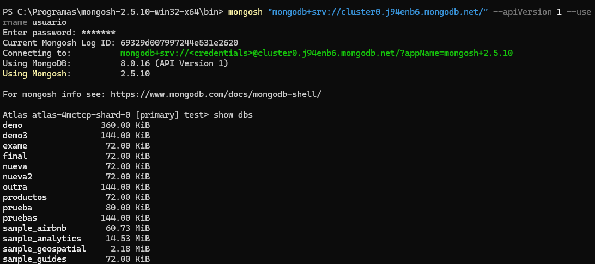
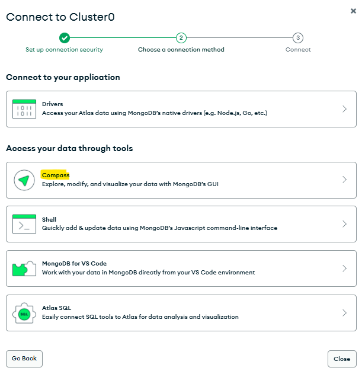
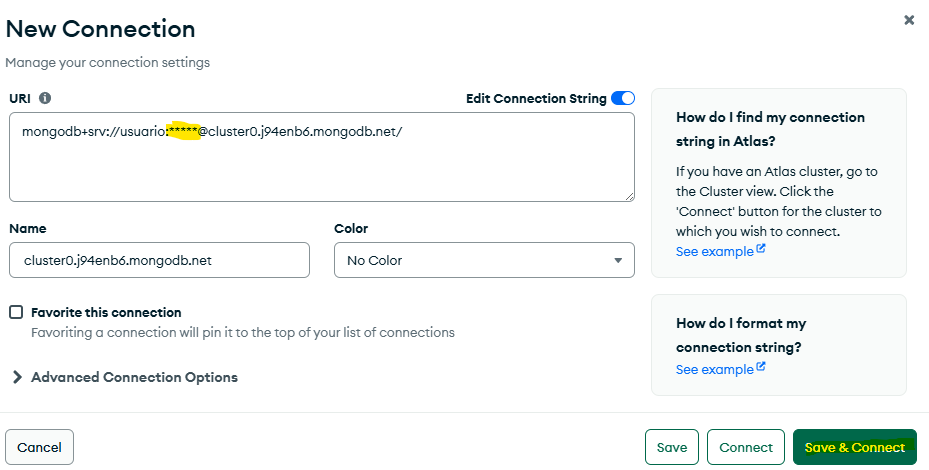
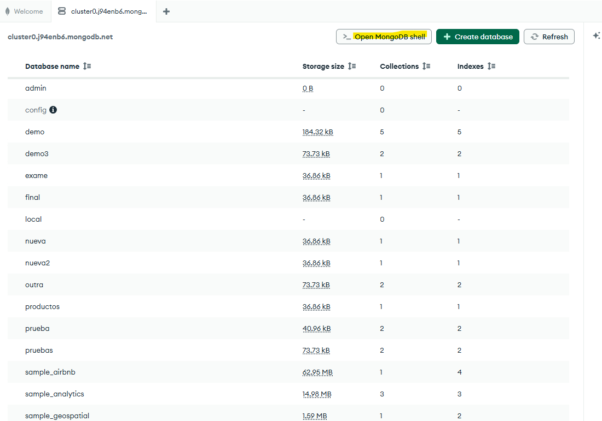
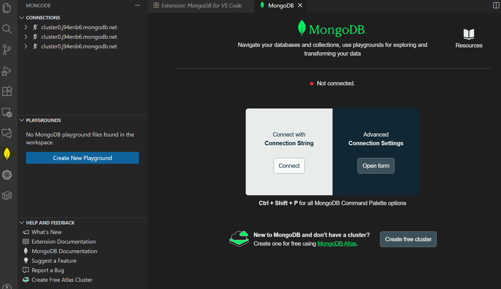
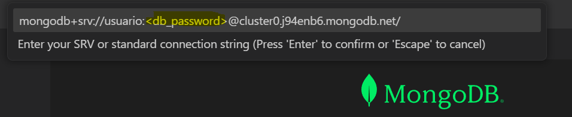
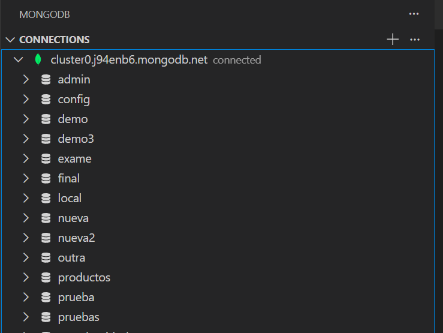

# Ferramentas básicas de MongoDB
A continuación preséntanse as principais ferramentas que empregaremos ao traballar con MongoDB, tanto en contornos locais como na nube.

## 1. mongosh

Shell oficial de MongoDB que permite interactuar coa base de datos
mediante comandos escritos en JavaScript.

### Uso desde Docker / GNU/Linux
Acceso a un contedor de *MongoDB* e apertura de *mongosh*:
``` bash
docker exec -it bda-mongo bash
root@504c2b48427c:/# mongosh
```

Avisos típicos de arranque:

    Using the XFS filesystem is strongly recommended with WiredTiger.
    Access control is not enabled.
    transparent_hugepage en 'always'.
    vm.max_map_count baixo.

Estes avisos indican recomendacións para produción, pero non son relevantes para a aprendizaxe.
## 2. MongoDB Atlas

Servizo na nube para crear e administrar clústers.

1. Connect 

2. Shell 

3. Descargar mongosh e engadir ao PATH e copiamos a `connection string`.

4. Pegamos o comando nun terminal e introducimos o contrasinal.

## 3. MongoDB Database Tools

### 3.1 mongoimport / mongoexport

Importación/exportación en JSON.

### 3.2 mongodump / mongorestore

Copias de seguridade en BSON.

### 3.3 bsondump

Conversión de BSON a JSON.

## 4. MongoDB Compass

Ferramenta gráfica para explorar bases de datos, que tamén permite o uso de liña de comandos.
[MongoDB Compass](https://www.mongodb.com/es/products/tools/compass)

### Funcionalidades principais de MongoDB Compass

#### 1. **Explorar bases de datos e coleccións**
- Permite ver todas as bases de datos dispoñibles.
- Navegación visual por coleccións e documentos.
- Expansión intuitiva de obxectos e arrays.
- Moi útil para comprender estruturas complexas nunha base de datos NoSQL.

---

#### 2. **Construtor visual de consultas (*Query Builder*)**
- Interface gráfica para crear consultas sen escribir código.
- As consultas represéntanse automaticamente en JSON/BSON.
- Actualización dos resultados en tempo real.
- Ideal para aprender ou probar consultas antes de usalas en produción.

---

#### 3. **Visualización do esquema (*Schema Analysis*)**
- Compass analiza unha mostra de documentos dunha colección.
- Detecta:
  - Tipos de datos usados en cada campo.
  - Frecuencias e distribución dos valores.
  - Campos opcionais ou inconsistentes.
- Excelente para detectar problemas de modelado e comprender datos herdados.

---

#### 4. **Xestión de índices**
- Visualización de índices existentes nunha colección.
- Creación de novos índices desde unha interface gráfica.
- Información sobre o tamaño, tipo e uso de cada índice.
- Axuda a mellorar o rendemento das consultas.

---

### 5. **Validación de documentos**
- Permite definir regras de validación segundo un esquema.
- Útil para aplicar estritas normas de calidade nunha colección.
- Evita insercións incorrectas ou con tipos mal formados.

---

#### 6. **Operacións CRUD desde a interface**
- Inserción de novos documentos.
- Modificación e edición visual de documentos existentes.
- Eliminación de documentos dun modo seguro.
- Moi útil para probas rápidas e manipulación sinxela dos datos.

---

#### 7. **Monitorización básica**
- Compass mostra métricas en tempo real como:
  - Operacións por segundo.
  - Lecturas e escrituras.
  - Uso de memoria e actividade do servidor.
- Pensado para desenvolvemento, non para monitorización profesional.

### Descarga e configuración
Proceso moi parecido ao seguido par `mongosh`. 
1. Pulsamos `connect` e esta vez seleccionamos `Compass`.

2. Se non o temos descargado seleccionamos o sistema operativo e a versión (por exemplo, `msi` ou `zip`) e prememos para descargar. Despois copiamos a `connection string`.
3. Prememos o símbolo `+` ao lado de `connections` e pegamos a nosa `connection string`, introducindo o noso contrasinal.

4. Xa podemos explorar as nosas bases de datos de modo gráfico ou abrir un `shell` (a vantaxe respecto a `mongosh` é que ten función de autocompletado).

## 5. MongoDB for VSCode
Extensión de VSCode para traballar con MongoDB.
Para empregala seguimos estes pasos:

1. Descargamos a extensión e, unha vez instalada, selecionamos o símbolo de `MongoDB` na barra da esquerda. Despois seleccionamos `connect`.

2. Na parte superior pegamos a nosa `connection string` introducindo o noso contrasinal.

3. Se todo é correcto podemos ver as nosas bases de datos:


