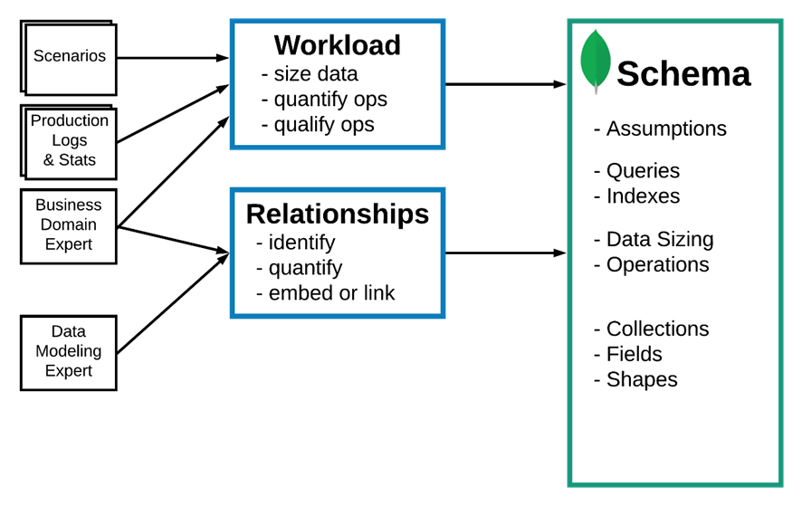
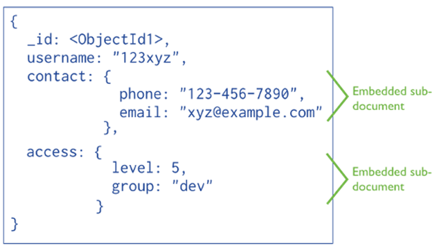

# Modelado documental en MongoDB

Antes de empezar é importante lembrar que:

- Nun **documento** podemos manter xuntos todos os datos que se empregan no mesmo contexto, sen necesidade de dividir a información en varias coleccións.
- As propiedades transaccionais **ACID** cúmprense **a nivel de documento**.  
  Se a información está distribuída en varios documentos, necesitaremos empregar **transaccións de MongoDB** para garantir consistencia.

Dependendo do tipo de relación entre datos, podemos:

- Crear **referencias** entre documentos.
- **Incrustar (embeber)** documentos dentro doutros.

---

## Metodoloxía de modelado de datos

MongoDB recomenda seguir unha metodoloxía en tres fases:

### 1) Definir a carga (*workload*)

É necesario comprender para que operacións se está a modelar. Para iso débese:

- Medir os datos que se van almacenar.
- **Cuantificar e cualificar** as operacións de lectura e escritura.
- Elaborar unha **lista das operacións máis importantes**, as que se executarán con maior frecuencia.

### 2) Modelar as relacións

- Relacións **1:1** → documento **embebido**.
- Relacións **1:M** e **N:M** →  
  - **Array de documentos embebidos**, ou  
  - **Referencias** a documentos doutra colección.

### 3) Recoñecer e aplicar patróns de deseño

Inclúe modificacións do esquema centradas en:

- Mellorar o **rendemento**.
- Facilitar o **mantemento**.
- Simplificar o esquema ou reducir redundancias.

---

## Técnicas de modelado

Existen dúas técnicas principais:

1. **Referencias**  
2. **Embeber documentos**

---

## Referencias entre documentos

### Referencias manuais

Funciona do mesmo modo que unha clave allea nun SGBDR:  
Un campo dun documento almacena o `_id` doutro documento.

```javascript
db.coleccion1.insertOne({ _id: idDocumento1, campo1: "valor1", campo2: "valor2" })

db.coleccion2.insertOne({ documento1_id: idDocumento1, campoA: "valorA", campoB: "valorB" })
```

### DBRef

MongoDB ofrece un formato estándar para referencias:

```javascript
{
  "$ref": "nome_coleccion",
  "$id": valor_id,
  "$db": "nome_base_datos"   // opcional
}
```

Exemplo:

```javascript
db.coleccion2.insertOne({
  coleccion1_id: new DBRef("coleccion1", idColeccion1),
  campo1: valor1,
  campo2: valor2
})
```

> Nota: **DBRef non é recomendado en moitos casos** porque require consultas adicionais. As referencias manuais son máis flexibles.

---

## Documentos embebidos

Consiste en almacenar os datos dun documento **como subdocumento** doutro.  
Isto permite obter toda a información necesaria nun único acceso.

É apropiado para:

- Relacións **"contén"** (composición).
- Relacións **un a un (1:1)**.
- Relacións **un a poucos (1:Few)**.

---

## Tipos de relacións

| Tipo de relación | Recomendación |
|------------------|--------------|
| **1:1** | Embeber |
| **1:F (One-to-Few)** | Embeber nun array |
| **1:N (One-to-Many)** | Referencias, desde o lado “moitos” |
| **1:Z (One-to-Zillions)** | Array de referencias |
| **N:M (Many-to-Many)** | Tres opcións |

### Relacións N:M: tres solucións posibles

1. **Colección intermedia** que almacena referencias aos documentos participantes.  
2. **2-way embedding**:  
   cada documento das dúas coleccións almacena un array de referencias ao outro lado.  
3. **Embeber documentos completos** → *non recomendado*, risco de redundancia e inconsistencias.

---

## Validación de esquemas

Aínda que MongoDB é *schemaless*, permite definir restricións sobre o esquema para:

- Asegurar que un campo existe.
- Asegurar que **non** é nulo.
- Verificar o **tipo de datos**.
- Restringir a valores dun conxunto.

Desde MongoDB **3.6**, pódese incluír un **$jsonSchema** ao crear unha colección.

### Exemplo de validador

```javascript
validadorVideojuegos = {
  validator: {
    $jsonSchema: {
      bsonType: "object",
      required: ["titulo", "compañia"],
      title: "Validador de videoxogos",
      properties: {
        titulo: {
          bsonType: "string",
          description: "Debe ser unha string e é obrigatorio"
        },
        compañia: {
          bsonType: "string",
          description: "Debe ser unha string e é obrigatorio"
        },
        plataformas: {
          bsonType: "array",
          uniqueItems: true,
          items: { bsonType: "string" }
        },
        genero: { bsonType: "string" }
      }
    }
  }
}

db.createCollection("videojuegos", validadorVideojuegos)
```

---

### Consultar o validador dunha colección

```javascript
db.getCollectionInfos({ name: "nome_coleccion" })[0].options.validator
```

### Modificar o validador dunha colección existente

```javascript
db.runCommand({
  collMod: "nome_coleccion",
  validator: novoValidador
})
```

