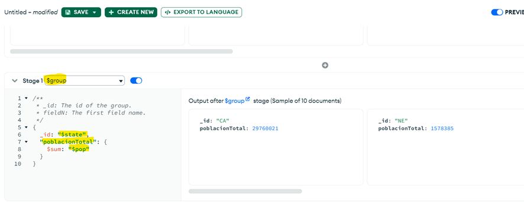
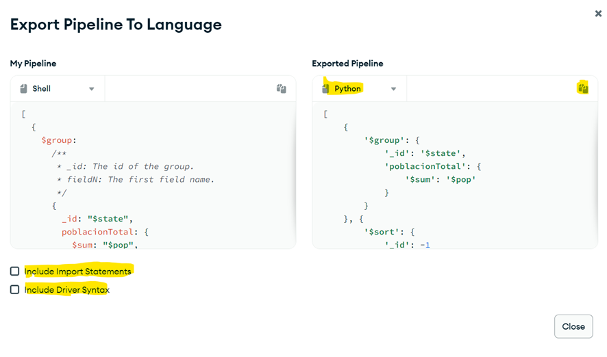

# Agregacións en MongoDB

MongoDB ofrece varias opcións para agrupar datos e realizar cálculos sobre eles:

- Uso de **mapReduce()**, *deprecated* desde MongoDB 5.0.
- Uso de **$function** e **$accumulator**, que permiten definir expresións de agregación en JavaScript.
- Uso de operacións sinxelas como **count()** ou **distinct()**.
- Uso do **Aggregation Framework**, a opción máis utilizada. Está baseado nun sistema de *pipelines*, onde cada fase transforma os datos antes de pasalos á seguinte.

A sintaxe básica é:

```javascript
db.coleccion.aggregate([ op1, op2, ... opN ])
```

---

## Operadores do pipeline

| Operador  | Descrición | Cardinalidade |
|-----------|------------|---------------|
| **$project** | Proxección de campos (similar a SELECT) | 1:1 |
| **$match**   | Filtrado de documentos (similar a WHERE) | N:1 |
| **$group**   | Agrupación de documentos (similar a GROUP BY) | N:1 |
| **$sort**    | Ordenación | 1:1 |
| **$skip**    | Saltar un número de documentos | N:1 |
| **$limit**   | Limitar resultados | N:1 |
| **$unwind**  | Descompoñer un array en varios documentos | 1:N |

---

### Operador $group

Permite agrupar documentos para calcular valores agregados. Normalmente úsase xunto con **acumuladores**:

| Acumulador | Descrición |
|------------|------------|
| **$addToSet** | Devolve unha lista cos valores únicos |
| **$first** | Primeiro valor do grupo |
| **$last** | Último valor do grupo |
| **$max** | Valor máximo |
| **$min** | Valor mínimo |
| **$avg** | Media |
| **$push** | Engadir valores a un array (permite repeticións) |
| **$sum** | Suma de valores do grupo |

Exemplo:

```javascript
db.coleccion.aggregate([
  { $group: { _id: "$campo_agrupar", campo: { $sum: "$valor" } } }
])
```

Renomear o campo do agrupamento:

```javascript
db.coleccion.aggregate([
  { $group: { _id: { novoNome: "$campo_agrupar" }, campo: { $sum: "$valor" } } }
])
```

---

### Operador $sort

Ordena de forma ascendente (1) ou descendente (-1):

```javascript
db.coleccion.aggregate([
  { ... },
  { $sort: { campo: -1 } }
])
```

---

### Operador $project

Utilízase para seleccionar, transformar e crear novos campos no resultado.

Permite:

- Renomear campos.
- Crear campos calculados usando **$add**, **$subtract**, **$multiply**, **$divide**, **$mod**.
- Manipular *strings* con **$toUpper**, **$toLower**, **$concat**, **$substr**.
- Crear campos condicionais usando operadores de comparación.

Sintaxe:

```javascript
db.coleccion.aggregate([
  { $project: { ... } }
])
```

#### Exemplos

**1. Proxección simple ocultando `_id`:**

```javascript
db.coleccion.aggregate([
  { $project: { _id: 0, campo1: 1, campo3: 1 } }
])
```

**2. Transformación de textos e renomeado:**

```javascript
db.coleccion.aggregate([
  { $project: {
      campo1a: { $toUpper: "$campo1" },
      campoX: "$campo2.subcampo1"
  }}
])
```

**3. Campo numérico calculado:**

```javascript
db.coleccion.aggregate([
  { $project: {
      campo1a: "$campo1",
      campo2a: { $multiply: ["$campo2", 1.21] }
  }}
])
```

**4. Crear un subdocumento:**

```javascript
db.coleccion.aggregate([
  { $project: {
      campo1: "$campo1",
      detalles: {
        campo2a: "$campo2",
        campo3a: "$campo3"
      }
  }}
])
```

---

### Operador $match

Filtra documentos no pipeline.

```javascript
db.coleccion.aggregate([
  { $match: {
      campo1: valor1,
      campo2: { $lt: valor2 },
      campo3: { $in: [valor31, valor32] }
  }}
])
```

---

### Operador $limit

Limita o número de documentos devoltos:

```javascript
db.coleccion.aggregate([
  { $limit: numero }
])
```

---

### Operador $skip

Sáltase un número de documentos:

```javascript
db.coleccion.aggregate([
  { $skip: numero }
])
```

---

### Operador $unwind

Descompón un array en varios documentos:

```javascript
db.coleccion.aggregate([
  { $unwind: "$campoArray" }
])
```

Se hai varios arrays, o resultado pode ser un **produto cartesiano**.

---

### Operador $lookup

Permite unir datos de dúas coleccións (similar a JOIN):

- **from**: colección coa que se realiza a unión
- **localField**: campo da colección actual
- **foreignField**: campo da colección externa
- **as**: nome do campo onde se gardará o resultado

---

### Operador $out

Garda o resultado do pipeline nunha nova colección:

```javascript
db.coleccion.aggregate([
  { ... },
  { $out: "nova_coleccion" }
])
```

---

### Operador $merge

Similar a `$out`, pero se a colección xa existe, insire ou actualiza:

```javascript
db.coleccion.aggregate([
  { ... },
  { $merge: "coleccion_existente" }
])
```

---

## Comparativa SQL – Aggregation Pipeline

| SQL | Aggregation Pipeline |
|-----|----------------------|
| WHERE | $match |
| GROUP BY | $group |
| HAVING | $match |
| SELECT | $project |
| ORDER BY | $sort |
| LIMIT | $limit |
| SUM() | $sum |
| COUNT() | $sum: 1 |
| JOIN | $lookup |

Máis exemplos oficiais:  
https://www.mongodb.com/docs/manual/reference/sql-aggregation-comparison/

---

## Agregacións en MongoDB Compass

MongoDB Compass inclúe unha ferramenta gráfica para crear pipelines de agregación.

Pasos:

1. Seleccionar a base de datos e colección.
2. Ir á pestana **Aggregations**.
3. Premer **Add Stage** para engadir fases ao pipeline.

4. Escoller o operador e completar os campos necesarios.
5. Na parte dereita móstrase unha vista previa do resultado.

Compass permite:

- Gardar o pipeline como consulta ou como vista.
- Exportalo a linguaxes como Python, Java, Ruby, etc.
- Copiar o código xerado para usalo en aplicacións.



Temos varias opcións como incluír as sentenzas de importación ou a sintaxis do propio linguaxe de programación (por defecto só inclúe o código da consulta). Tamén podemos seleccionar a linguaxe (Python, java, ruby, etc.). Por último, podemos copiar o código xerado para usalo nos nosos programas.

## Exemplos

### Exemplos básicos de Aggregation Pipeline

1. Agrupar documentos da colección `grades` (BD: sample_training) contando cantos rexistros hai por estudante.
```javascript
use sample_training
db.grades.aggregate([
  { $group: { _id: "$student_id", total: { $sum: 1 } } }
])
```

2. Calcular a media de puntuación por asignatura na colección `grades`.
```javascript
use sample_training
db.grades.aggregate([
  { $group: { _id: "$class_id", media_score: { $avg: "$score" } } }
])
```

### Uso de $match e $group

3. Seleccionar só as puntuacións maiores de 70 e agrupar por estudante.
```javascript
use sample_training
db.grades.aggregate([
  { $match: { score: { $gt: 70 } } },
  { $group: { _id: "$student_id", total: { $sum: 1 } } }
])
```

4. Contar cantas cidades hai por estado usando `zips`.
```javascript
use sample_training
db.zips.aggregate([
  { $group: { _id: "$state", total_cities: { $sum: 1 } } }
])
```

### Uso de $project

5. Amosar en `zips` o campo city en maiúsculas.
```javascript
use sample_training
db.zips.aggregate([
  { $project: { _id: 0, city_upper: { $toUpper: "$city" } } }
])
```

6. Crear un novo campo chamado `densidade` dividindo `pop` entre `area`.
```javascript
use sample_training
db.zips.aggregate([
  { $project: {
      _id: 0,
      city: 1,
      densidade: { $divide: ["$pop", "$area"] }
  }}
])
```

### Uso de $sort, $limit e $skip

7. Amosar as 5 cidades máis poboadas.
```javascript
use sample_training
db.zips.aggregate([
  { $sort: { pop: -1 } },
  { $limit: 5 }
])
```

8. Amosar as 10 seguintes cidades máis poboadas (saltando as 10 primeiras).
```javascript
use sample_training
db.zips.aggregate([
  { $sort: { pop: -1 } },
  { $skip: 10 },
  { $limit: 10 }
])
```

### Uso de $unwind

9. Amosar unha fila por cada xénero dunha película (BD: sample_mflix).
```javascript
use sample_mflix
db.movies.aggregate([
  { $unwind: "$genres" }
])
```

10. Contar cantas películas pertencen a cada xénero.
```javascript
use sample_mflix
db.movies.aggregate([
  { $unwind: "$genres" },
  { $group: { _id: "$genres", total: { $sum: 1 } } }
])
```

### Uso de $lookup

11. Unir a colección `listingsAndReviews` coas reviews segundo o `_id` (BD: sample_airbnb).
```javascript
use sample_airbnb
db.listingsAndReviews.aggregate([
  { 
    $lookup: {
      from: "reviews",
      localField: "_id",
      foreignField: "listing_id",
      as: "reviews_info"
    }
  }
])
```

### Uso de $out e $merge

12. Gardar nunha nova colección os estados e o total de cidades.
```javascript
use sample_training
db.zips.aggregate([
  { $group: { _id: "$state", total: { $sum: 1 } } },
  { $out: "estados_totais" }
])
```

13. Actualizar ou inserir resultados nunha colección existente.
```javascript
use sample_training
db.zips.aggregate([
  { $group: { _id: "$state", total: { $sum: 1 } } },
  { $merge: "totais_estados" }
])
```
