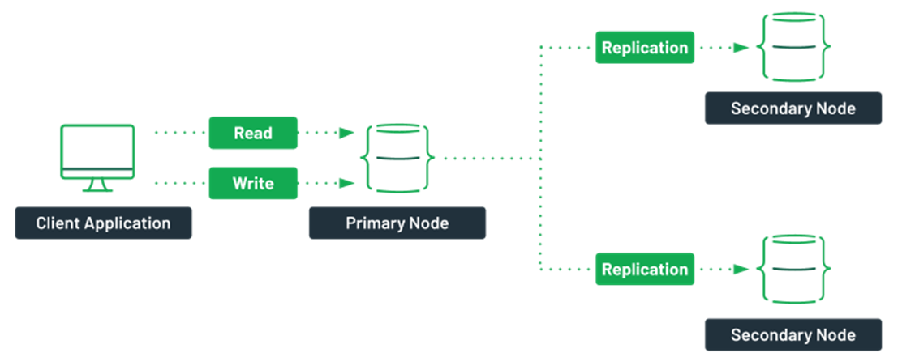
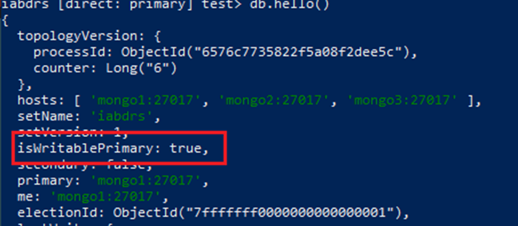
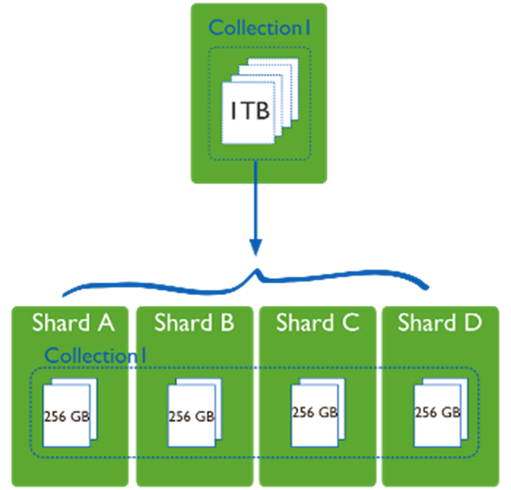
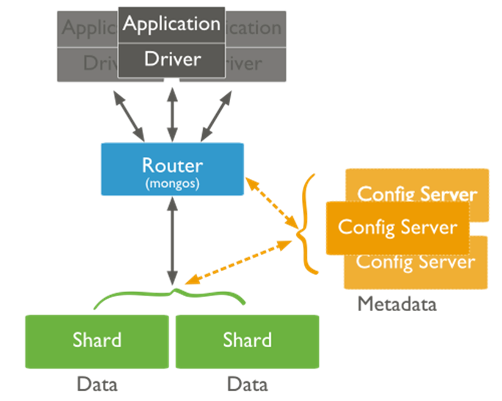
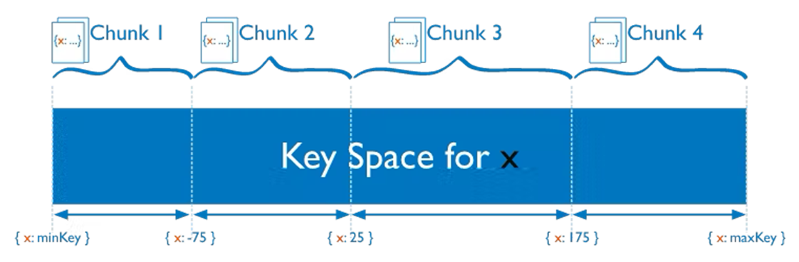
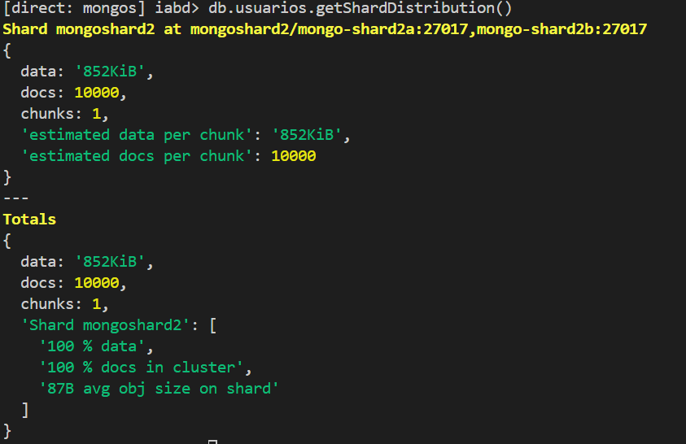
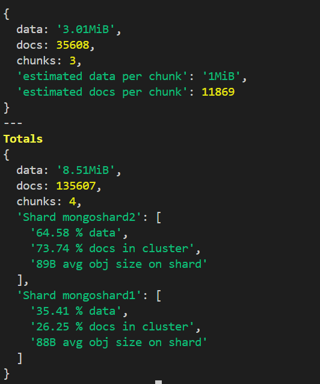

# Replicación e particionado
## Replicación
MongoDB soporta replicación de datos nativas mediante o uso de conxuntos de réplicas (ReplicaSet).

**ReplicaSet**: grupo de nodos onde un deles exerce a función de primario (recibe peticións) e o resto exercen a función de secundario (mantendo copias dos datos).

Se o nodo primario cae escóllese un novo entre os nodos secundarios.


### Tipos de nodos:
**Regulares**: Conteñen datos, poden ser primarios ou secundarios.
- **Primario**: Acepta as peticións dos clientes, asegurando **consistencia estricta** para as lecturas.
- **Secundario**: Manteñen copia dos datos. Poden estar configurados para aceptar lecturas ou non. No caso de facelo a **consistencia** será **eventual**.

**Árbitro**: Só para enrutamento e votos.

**Retrasado**: Vai un paso por detrás dos demais. E é a última opción cando as cousas van moi mal. Tamén denominado *nodo de desastres*.

**Oculto**: Módulo que se implementa só para funcións analíticas.

A replicación pódese levar a cabo grazas ao oplog.
- **oplog**: diario de todos os cambios que o nodo primario realiza sobre as bases de datos, o cal permite replicar os cambios a nondos secundarios.

O nodo **primario** mantén o *oplog* cun *timestamp* para cada entrada. O **secundario** consulta o *oplog* e grazas ao *timestamp* coñece as novas operacións.

### Implementación da replicación empregando docker
Imos implementar a replicación empregando contedores de docker. Para conseguilo precisamos:
- Arquivo `docker-compose` que crea 3 contedores: (`mongo1`, `mongo2` e `mongo3`).
- Script `rs_init.sh`: que de fine a configuración do clúster, iniciando o *ReplicaSet*.
- Script `init.js`: crea o usuario administrador da BD.

**docker-compose.yml**
```yaml
services:
  mongo1:
    container_name: mongo1
    image: mongo
    volumes:
      - ./rs-init.sh:/scripts/rs-init.sh
      - ./init.js:/scripts/init.js
    networks:
      - mongo-network
    ports:
      - 27017:27017
    depends_on:
      - mongo2
      - mongo3
    links:
      - mongo2
      - mongo3
    entrypoint: [ "/usr/bin/mongod", "--bind_ip_all", "--replSet", "abgrs" ]

  mongo2:
    container_name: mongo2
    image: mongo
    networks:
      - mongo-network
    ports:
      - 27018:27017
    entrypoint: [ "/usr/bin/mongod", "--bind_ip_all", "--replSet", "abgrs" ]
  mongo3:
    container_name: mongo3
    image: mongo
    networks:
      - mongo-network
    ports:
      - 27019:27017
    entrypoint: [ "/usr/bin/mongod", "--bind_ip_all", "--replSet", "abgrs" ]

networks:
  mongo-network:
    driver: bridge
```

**rs-init.sh**
```bash
#!/bin/bash

DELAY=10

mongosh <<EOF
var config = {
    "_id": "abgrs",
    "version": 1,
    "members": [
        {
            "_id": 1,
            "host": "mongo1:27017",
            "priority": 2
        },
        {
            "_id": 2,
            "host": "mongo2:27017",
            "priority": 1
        },
        {
            "_id": 3,
            "host": "mongo3:27017",
            "priority": 1
        }
    ]
};
rs.initiate(config, { force: true });
EOF

echo "****** Esperando ${DELAY} segundos a que se apliquen la configuración del conjunto de réplicas ******"

sleep $DELAY

mongosh < /scripts/init.js
```

**init.js**
```javascript
rs.status();
db.createUser({user: 'admin', pwd: 'admin', roles: [ { role: 'root', db: 'admin' } ]});
```

> Os tres ficheiros poden atoparse no cartafol `replicaset` deste repositorio.

#### Procedemento
1. O primeiro paso é lanzar o docker compose.
```bash
#Dende o directorio no que se atopa o docker-compose.yml
docker compose up -d
```
2. Executamos o script de inicialización no nodo primario.
```bash
docker exec mongo1 sh /scripts/rs-init.sh
```
3. Conectámonos ao nodo primario
```bash
docker exec -it mongo1 mongosh
```
4. Unha vez estamos conectados comprobamos o tipo de nodo co seguinte comando.
```javascript
db.hello()
```
Se aparece a opción `isWritablePrimary` co valor `True` todo está correcto.


Por defecto só se permiten lecturas en nodos primarios. Para modificalo deben cambiarse as preferencias de lectura:
### Modos de lectura en MongoDB

| Modo de lectura        | Descrición |
|------------------------|------------|
| **primary**            | Só se realizan no nodo primario. |
| **primaryPreferred**   | Se o nodo primario está dispoñible, as lecturas realízanse nel. |
| **secondary**          | Todas as lecturas realízanse en nodos secundarios. |
| **secondaryPreferred** | As lecturas realízanse en nodos secundarios; se non están dispoñibles, úsase o primario. |
| **nearest**            | Emprega o nodo máis próximo segundo a latencia. |

Para consultar ou modificar as preferencias de lectura poden empregarse os seguintes comandos:
```javascript
// Consultar
db.getMongo().getReadPref()

// Modificar
db.getMongo().setReadPref(‘secondary’)
```

### Consistencia de escritura
MongoDB permite configurar o mecanismo de consistencia segundo a necesidade de equilibrio entre **seguridade dos datos** e **rendemento**. Os principais parámetros son:
- **w** → número de servidores que deben confirmar a escritura.
- **j** → indica se as escrituras deben persistirse no *journal*.
- **wtimeout** → tempo máximo de espera para a confirmación (*write concern timeout*).

Niveis de consistencia de escritura:
- **Sen confirmación** (`w: 0`)
Non hai garantía de que a operación se complete. Máximo rendemento, mínima consistencia.

- **Con confirmación estándar** (`w:1`)
Modo por defecto.  
O nodo primario confirma a operación e envía *ack* ao cliente.
```javascript
{ w: 1 }
```

- **Confirmación con diario** (`w: 1,j: true`)
O servidor confirma a operación **só despois de escribila no journal**, aumentando durabilidade.
```javascript
{ w: 1, j: true }
```

- **Confirmación por maioría** (`w: "majority"`)
A operación considérase completada cando a maioría dos nodos do clúster replican o cambio.
```javascript
{ w: "majority" }
```
Garante a máxima consistencia a costa de empeorar o rendemento.

### Consistencia de escritura
Tamén hai diferentes niveis de consistencia de escritura:
- **local**: devólvese o dato máis recente, pero non se garante que estea replicado.
- **available**: equivalente a *local*, pero aplicado a nodos secundarios.
- **majority**: datos confirmados pola maioría dos nodos.
- **snapshot**: só para transaccións multidocumento; realiza unha “foto” consistente ao inicio da transacción.

### Tolerancia a fallos
-Cando un nodo primario non se comunica co resto durante máis de 10 segundos, inténtase escoller outro nodo primario.

**Votación**:
- O proceso dura menos de 3 segundos (durante este tempo non se aceptan escrituras).
- O nodo co maior número de votos convértese en primario.
- Compróbase:
  - Se hai conectividade co primario.
  - Se o candidato ten unha réplica actualizada.
  - Se existe un nodo máis prioritario.

**Exemplo: comprobación de tolerancia**
Temos tres opcións para comprobar a tolerancia a fallos.
1. Parar o contedor:
```bash
docker stop mongo1
```
2. Degradar o nodo primario
```javascript
db.adminCommand({ shutdown: 1 })
```

3. Parar o servicio dende o nodo primario
```javascript
rs.stepDown()
```
Despois disto, entrando nos outros nodos, un deles ten que figurar como nodo primario.

## Particionado
O **particionado** ou **sharding** é unha técnica que fragmenta os datos da BD horizontalmente agrupándoos dalgún modo que teña sentido e permita un direccionamento máis rápido:


MongoDB implementa o **sharding** de forma nativa e automática baseada en **rangos**.  
Divídese unha colección en diferentes servidores empregando **mongos** como router das peticións entre os **sharded clusters**.  
O **balanceo automático** dos datos facilita o traballo de desenvolvemento.

Un `sharded cluster` ten os seguintes elementos:
- **Shards**: Máquinas do clúster que almacenan un subconxunto dos datos da colección (instancia de mongodb ou conxunto de réplicas).
-- **Servidores de configuración**: Instancia de mongod que almaecena metadatos sobre o clúster. En producción aconséllase ter 3.
- **Enrutadores**: Instancia de mongos que enruta as lecturas e escrituaras hacia os shards.


Unha `shard key` é un campo que determina a distribución dos documentos entre os *shards*. É habitual que se emprege o identificador, ainda que pode ser outro campo. Sexa como sexa, debe estar **indexado**.


### Implementación do particionado con docker
Para implementar o particionado necesítanse os seguintes compoñentes:
- Un contedor para o *router*.
- Un contedor para o *servidor de configuración*.
- Dous contedores que serán os nodos do *primeiro shard* (conxunto de réplicas).
- Dous contedores que serán os nodos do *segundo shard* (conxunto de réplicas).

Para implementar esta estrutura en docker precisamos os seguintes arquivos:
- Arquivo `docker-compose` para crear os contedores necesarios.
- Script `configserver-init.js`: para inicializar os servidores de configuración.
- Scripts `shard1-init.js` e `shard2-init.js`: para inicializar cada conxunto de réplicas.
- Script `router-init.js`: para configurar o router.

**docker-compose.yml**
```yaml
services:

  router1:
    container_name: router1
    image: mongo
    volumes:
      - ./router-init.js:/scripts/router-init.js
    networks:
      - mongo-network-sharded
    ports:
      - 27117:27017
    entrypoint: [ "/usr/bin/mongos", "--port", "27017", "--configdb", "rs-config-server/configsvr1:27017", "--bind_ip_all" ]

  configsvr1:
    container_name: configsvr1 
    image: mongo
    volumes:
      - ./configserver-init.js:/scripts/configserver-init.js
    networks:
      - mongo-network-sharded
    ports:
      - 27118:27017
    entrypoint: [ "/usr/bin/mongod", "--port", "27017", "--configsvr", "--replSet", "rs-config-server", "--bind_ip_all" ]
    links:
      - mongo-shard1a
      - mongo-shard2a

  mongo-shard1a:
    container_name: mongo-shard1a
    image: mongo
    volumes:
      - ./shard1-init.js:/scripts/shard1-init.js
    networks:
      - mongo-network-sharded
    ports:
      - 27119:27017
    entrypoint: [ "/usr/bin/mongod", "--port", "27017", "--shardsvr", "--bind_ip_all", "--replSet", "mongoshard1" ]

  mongo-shard1b:
    container_name: mongo-shard1b
    image: mongo
    networks:
      - mongo-network-sharded
    ports:
      - 27120:27017
    entrypoint: [ "/usr/bin/mongod", "--port", "27017", "--shardsvr", "--bind_ip_all", "--replSet", "mongoshard1" ]

  mongo-shard2a:
    container_name: mongo-shard2a
    image: mongo
    volumes:
      - ./shard2-init.js:/scripts/shard2-init.js
    networks:
      - mongo-network-sharded
    ports:
      - 27121:27017
    entrypoint: [ "/usr/bin/mongod", "--port", "27017", "--shardsvr", "--bind_ip_all", "--replSet", "mongoshard2" ]

  mongo-shard2b:
    container_name: mongo-shard2b
    image: mongo
    networks:
      - mongo-network-sharded
    ports:
      - 27122:27017
    entrypoint: [ "/usr/bin/mongod", "--port", "27017", "--shardsvr", "--bind_ip_all", "--replSet", "mongoshard2" ]

networks:
  mongo-network-sharded:
    driver: bridge
```

**configserver-init.js**
```javascript
rs.initiate({_id: "rs-config-server", configsvr: true, version: 1, members: [ { _id: 0, host : 'configsvr1:27017' } ] })
```

**shard1-init.js**
```javascript
rs.initiate(
  {
     _id: "mongoshard1",
     version: 1,
     members: [
        { _id: 0, host : "mongo-shard1a:27017" },
        { _id: 1, host : "mongo-shard1b:27017" },
     ]
  }
)
```

**shard2-init.js**
```javascript
rs.initiate(
  {
     _id: "mongoshard2",
     version: 1,
     members: [
        { _id: 0, host : "mongo-shard2a:27017" },
        { _id: 1, host : "mongo-shard2b:27017" },
     ]
  }
)
```

**router-init.js**
```javascript
sh.addShard("mongohard1/mongo-shard1a:27017")
sh.addShard("mongoshard1/mongo-shard1b:27017")
sh.addShard("mongoshard2/mongo-shard2a:27017")
sh.addShard("mongoshard2/mongo-shard2b:27017")
```

#### Procedemento
1. Lanzamos os servizos:
```bash
docker compose up -d
```

2. Configuramos o `configserver`:
```bash
docker exec configsvr1 sh -c "mongosh < /scripts/configserver-init.js"

```
3. Inicializamos os conxuntos de réplicas:
```bash
docker exec mongo-shard1a sh -c "mongosh < /scripts/shard1-init.js"
docker exec mongo-shard2a sh -c "mongosh < /scripts/shard2-init.js"
```

4. Configuramos o router:
```bash
docker exec router1 sh -c "mongosh < /scripts/router-init.js"
```

5. Para comprobar que todo está correcto conectámonos ao router e comprobamos o estado do particionado:

```bash
docker exec -it router1 bash
mongosh
```
```javascript
sh.status()
```
[Estado do sharding](images/mongo-sharding-status-1.png)

6. Habilitar o *sharding* a nivel de BD. 
  - Primeiro é necesario crear unha colección de proba
```javascript
use iabd
for (var i=0; i<10000; i++) {
    db.usuarios.insertOne({"login":"usuario" + i, "nombre":"nombre" + i*2, "fcreacion": new Date()},  { writeConcern: { w:"0"}});
}

```
  - Habilitamos o sharding nesa BD
```javascript
sh.enableSharding(‘iabd’)

```

7. Habilitar o *sharding* a nivel de *colección*:
  - Creamos a `shard key`
```javascript
// Tres opcións. Para empregar a segunda e a terceira habería que repetir o bucle for cambiando o nome da BD.
db.usuarios.createIndex({“login” : 1})
db.usuarioshash.createIndex({“login”: “hashed”})
db.usuariosunique.creteIndex({“login”:1},{“unique”:true})
```
  - Particionamos a colección:
```javascript
sh.shardCollection("iabd.usuarios", {"login": 1}, false)
sh.shardCollection("iabd.usuariosunique", {"login": 1}, true)
sh.shardCollection("iabd.usuarioshash", {"login": "hashed"}, false)
```

> Neste punto o particionado está habilitado, pero todos os datos están no mesmo *shard*.



- Na documentación recoméndanse un par de opcións para "solucionar" isto:
  - Forzar o *split* automáticamente.
  ```javascript
    sh.splitFind("iabd.usuarios", {"login":1})
    
  ```
  - Forzar o *split* indicando onde cortar.
  ```javascript
    sh.splitAt("iabd.usuarios", { "login": "usuario10000" } )
  ```
> O máis probable e que sigamos na mesma situación. isto é debido a que o tamaño da nosa colección é demasiado pequeno para distribuir os datos en shard. Nun contorno real non serían necesarios os seguintes pasos:

8. Cambiamos a configuración para modificar o tamaño dos *chunks* e configurar o *balanceo*:
```javascript
use config

db.settings.updateOne({_id: "chunksize"},{$set: {_id:"chunksize", value: 1}}, {upsert: true})

db.adminCommand({ configureCollectionBalancing: "iabd.usuarios", chunkSize: 1, defragmentCollection: true, enableAutoMerger: true})

```

> Agora, deixando pasar certo tempo, deberíamos ver como os *chunks* de distribúen nos *shards*.

